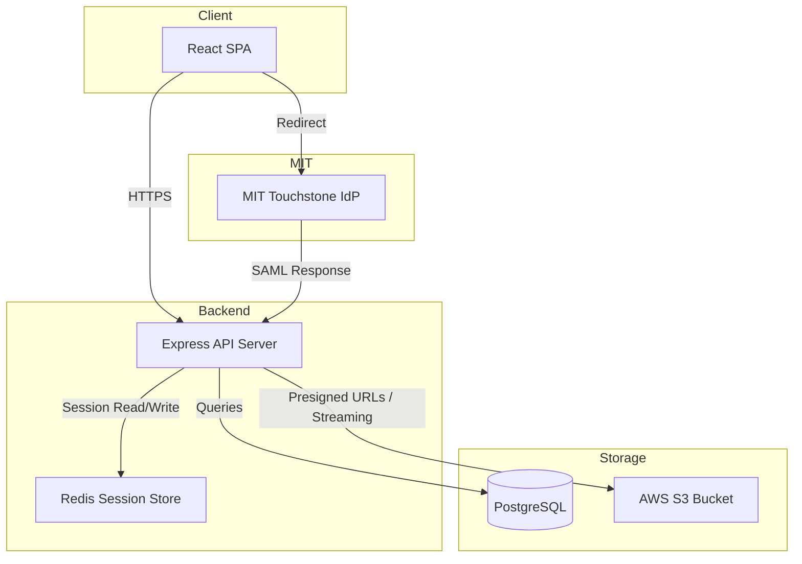
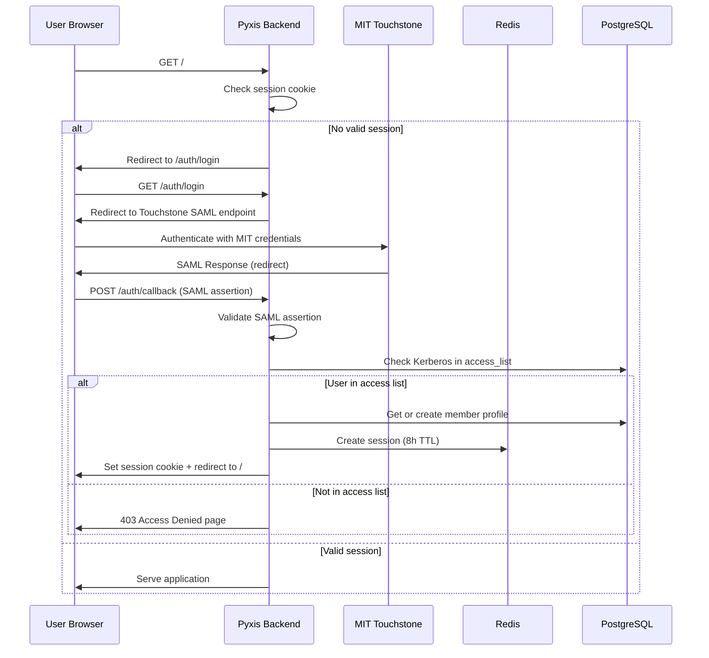
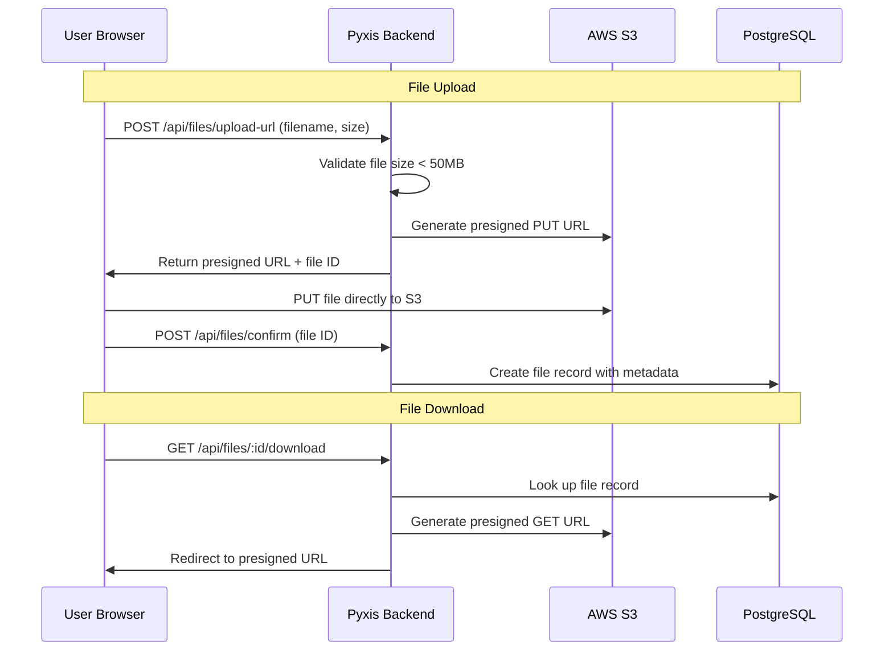
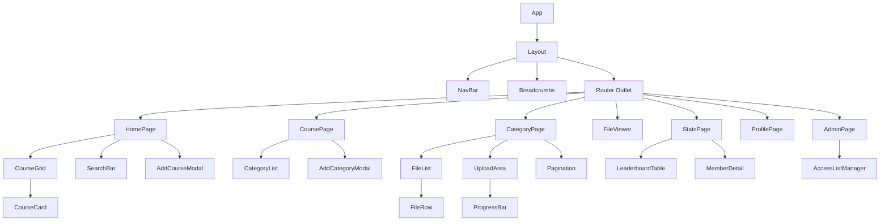
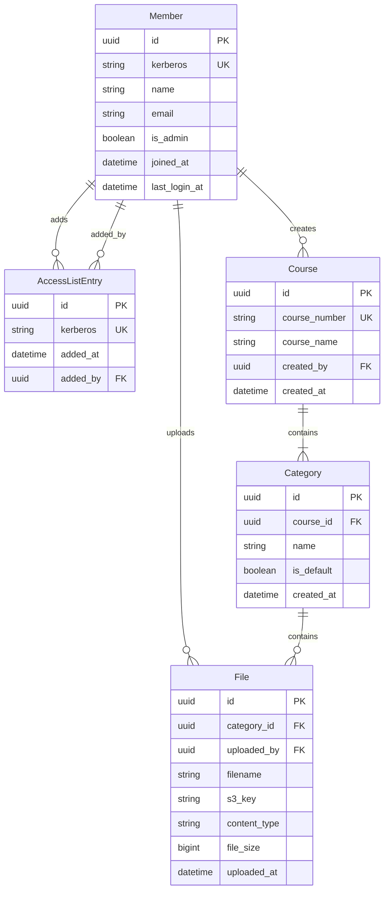

# Design Document: Pyxis Course Materials

## Overview

Pyxis is a course materials sharing platform for MIT's Chocolate City organization. It replaces an existing Google Drive-based system with a purpose-built web application that provides organized file browsing, uploading, member contribution statistics, and access control via MIT Touchstone authentication.

The application follows a traditional client-server architecture with a React single-page application (SPA) frontend and a Node.js/Express backend. File storage uses AWS S3, and metadata is stored in a PostgreSQL database. Authentication leverages MIT's Shibboleth/SAML-based Touchstone system with a local session layer.

### Key Design Decisions

| Decision | Choice | Rationale |
|----------|--------|-----------|
| Frontend Framework | React + TypeScript | Strong ecosystem, component reusability, type safety |
| UI Library | Tailwind CSS | Custom theming for black/gold brand, responsive utilities |
| Backend Runtime | Node.js + Express | JavaScript across the stack, mature SAML libraries available |
| Database | PostgreSQL | Relational model fits structured course/file metadata, strong query support |
| ORM | Prisma | Type-safe queries, migration management, works well with TypeScript |
| File Storage | AWS S3 | Scalable, cost-effective for file storage with presigned URLs for uploads/downloads |
| Authentication | passport-saml | Mature SAML 2.0 library for MIT Touchstone integration |
| Session Store | Redis | Fast session lookups, TTL-based expiry for 8-hour sessions |
| ZIP Generation | archiver (streaming) | Server-side ZIP creation without loading all files into memory |
| Bundler | Vite | Fast development builds, optimized production output |

## Architecture

### System Architecture Diagram



### Authentication Flow



### Request Flow for File Operations



## Components and Interfaces

### Frontend Component Hierarchy



### API Routes

#### Authentication

| Method | Path | Description |
|--------|------|-------------|
| GET | `/auth/login` | Initiate SAML login flow |
| POST | `/auth/callback` | Handle SAML assertion callback |
| POST | `/auth/logout` | Destroy session and redirect |
| GET | `/auth/session` | Return current session status |

#### Courses

| Method | Path | Description |
|--------|------|-------------|
| GET | `/api/courses` | List all courses (supports `?search=` query) |
| POST | `/api/courses` | Create a new course folder |
| GET | `/api/courses/:courseId` | Get course details with categories |

#### Categories

| Method | Path | Description |
|--------|------|-------------|
| GET | `/api/courses/:courseId/categories` | List categories for a course |
| POST | `/api/courses/:courseId/categories` | Create a custom category |

#### Files

| Method | Path | Description |
|--------|------|-------------|
| GET | `/api/categories/:categoryId/files` | List files (paginated, `?page=&limit=50`) |
| POST | `/api/files/upload-url` | Get presigned upload URL |
| POST | `/api/files/confirm` | Confirm upload completion |
| GET | `/api/files/:fileId/download` | Get presigned download URL |
| GET | `/api/files/:fileId/view` | Get presigned view URL |
| GET | `/api/categories/:categoryId/download-zip` | Download category as ZIP |
| GET | `/api/courses/:courseId/download-zip` | Download course as ZIP |

#### Members & Stats

| Method | Path | Description |
|--------|------|-------------|
| GET | `/api/members/me` | Get current member profile |
| GET | `/api/stats/leaderboard` | Get contribution leaderboard |
| GET | `/api/stats/members/:memberId` | Get member's detailed contributions |

#### Admin

| Method | Path | Description |
|--------|------|-------------|
| GET | `/api/admin/access-list` | List all entries in the access list |
| POST | `/api/admin/access-list` | Add entries (single or bulk) |
| DELETE | `/api/admin/access-list/:kerberos` | Remove an entry |

### Backend Service Layer

```
src/
├── server.ts                  # Express app setup
├── config/
│   ├── database.ts            # Prisma client
│   ├── redis.ts               # Redis connection
│   ├── s3.ts                  # S3 client
│   └── saml.ts                # SAML strategy config
├── middleware/
│   ├── auth.ts                # Session validation
│   ├── adminOnly.ts           # Academic Chair check
│   └── errorHandler.ts        # Centralized error handling
├── routes/
│   ├── auth.routes.ts
│   ├── course.routes.ts
│   ├── category.routes.ts
│   ├── file.routes.ts
│   ├── stats.routes.ts
│   └── admin.routes.ts
├── services/
│   ├── auth.service.ts        # Access list checks, session management
│   ├── course.service.ts      # Course CRUD, search
│   ├── category.service.ts    # Category CRUD
│   ├── file.service.ts        # Upload/download, presigned URLs
│   ├── stats.service.ts       # Leaderboard queries
│   └── zip.service.ts         # ZIP archive generation
├── validators/
│   ├── course.validator.ts    # Input validation schemas
│   ├── file.validator.ts
│   └── admin.validator.ts
└── types/
    └── index.ts               # Shared TypeScript types
```

### Frontend Structure

```
src/
├── main.tsx
├── App.tsx
├── api/
│   ├── client.ts              # Axios instance with auth interceptors
│   ├── courses.ts
│   ├── files.ts
│   ├── stats.ts
│   └── admin.ts
├── components/
│   ├── layout/
│   │   ├── NavBar.tsx
│   │   ├── Breadcrumbs.tsx
│   │   └── Layout.tsx
│   ├── courses/
│   │   ├── CourseGrid.tsx
│   │   ├── CourseCard.tsx
│   │   ├── SearchBar.tsx
│   │   └── AddCourseModal.tsx
│   ├── categories/
│   │   ├── CategoryList.tsx
│   │   └── AddCategoryModal.tsx
│   ├── files/
│   │   ├── FileList.tsx
│   │   ├── FileRow.tsx
│   │   ├── FileViewer.tsx
│   │   ├── UploadArea.tsx
│   │   └── ProgressBar.tsx
│   ├── stats/
│   │   ├── LeaderboardTable.tsx
│   │   └── MemberDetail.tsx
│   ├── admin/
│   │   └── AccessListManager.tsx
│   └── shared/
│       ├── Pagination.tsx
│       ├── EmptyState.tsx
│       ├── ErrorMessage.tsx
│       └── LoadingSpinner.tsx
├── hooks/
│   ├── useAuth.ts
│   ├── useCourses.ts
│   ├── useFiles.ts
│   └── useUpload.ts
├── pages/
│   ├── HomePage.tsx
│   ├── CoursePage.tsx
│   ├── CategoryPage.tsx
│   ├── FileViewerPage.tsx
│   ├── StatsPage.tsx
│   ├── ProfilePage.tsx
│   ├── AdminPage.tsx
│   └── AccessDeniedPage.tsx
├── styles/
│   └── theme.ts               # Tailwind theme tokens
├── types/
│   └── index.ts
└── utils/
    ├── formatting.ts          # Date formatting, filename truncation
    └── validation.ts          # Client-side validation helpers
```

## Data Models

### Entity Relationship Diagram



### Prisma Schema

```prisma
model Member {
  id          String   @id @default(uuid())
  kerberos    String   @unique
  name        String
  email       String
  isAdmin     Boolean  @default(false) @map("is_admin")
  joinedAt    DateTime @default(now()) @map("joined_at")
  lastLoginAt DateTime @updatedAt @map("last_login_at")

  uploadedFiles    File[]
  createdCourses   Course[]
  addedAccessEntries AccessListEntry[]

  @@map("members")
}

model AccessListEntry {
  id        String   @id @default(uuid())
  kerberos  String   @unique
  addedAt   DateTime @default(now()) @map("added_at")
  addedById String?  @map("added_by")
  addedBy   Member?  @relation(fields: [addedById], references: [id])

  @@map("access_list")
}

model Course {
  id           String   @id @default(uuid())
  courseNumber  String   @unique @map("course_number")
  courseName   String   @map("course_name")
  createdById  String   @map("created_by")
  createdBy    Member   @relation(fields: [createdById], references: [id])
  createdAt    DateTime @default(now()) @map("created_at")

  categories Category[]

  @@map("courses")
}

model Category {
  id        String   @id @default(uuid())
  courseId   String   @map("course_id")
  course    Course   @relation(fields: [courseId], references: [id], onDelete: Cascade)
  name      String
  isDefault Boolean  @default(false) @map("is_default")
  createdAt DateTime @default(now()) @map("created_at")

  files File[]

  @@unique([courseId, name])
  @@map("categories")
}

model File {
  id          String   @id @default(uuid())
  categoryId  String   @map("category_id")
  category    Category @relation(fields: [categoryId], references: [id], onDelete: Cascade)
  uploadedById String  @map("uploaded_by")
  uploadedBy  Member   @relation(fields: [uploadedById], references: [id])
  filename    String
  s3Key       String   @unique @map("s3_key")
  contentType String   @map("content_type")
  fileSize    BigInt   @map("file_size")
  uploadedAt  DateTime @default(now()) @map("uploaded_at")

  @@index([categoryId, uploadedAt(sort: Desc)])
  @@index([uploadedById])
  @@map("files")
}
```

### Session Data (Redis)

```typescript
interface SessionData {
  memberId: string;
  kerberos: string;
  name: string;
  isAdmin: boolean;
  createdAt: number;  // Unix timestamp
}
// Stored as: session:{sessionId} -> JSON(SessionData)
// TTL: 28800 seconds (8 hours)
```

### Validation Rules

| Entity | Field | Constraint |
|--------|-------|-----------|
| Course | courseNumber | Non-empty, max 20 characters, unique |
| Course | courseName | Non-empty, max 100 characters |
| Category | name | Non-empty, max 50 characters, unique within course |
| File | fileSize | Max 50 MB (52,428,800 bytes) |
| File | batch upload | Max 10 files per operation |
| AccessListEntry | kerberos | Must match pattern `^[a-z][a-z0-9_]{0,7}@mit.edu$` |
| Bulk add | count | Max 50 identifiers per operation |
| Member display | name | Truncated to 30 characters in navigation |
| File display | filename | Truncated to 80 characters with ellipsis |


## Correctness Properties

*A property is a characteristic or behavior that should hold true across all valid executions of a system — essentially, a formal statement about what the system should do. Properties serve as the bridge between human-readable specifications and machine-verifiable correctness guarantees.*

### Property 1: Access list membership round-trip

*For any* valid Kerberos identifier, adding it to the access list and then checking membership should return true.

**Validates: Requirements 1.2, 2.2**

### Property 2: Access list removal revokes membership

*For any* valid Kerberos identifier that exists in the access list, removing it and then checking membership should return false.

**Validates: Requirements 2.3**

### Property 3: Bulk access list parsing

*For any* list of valid Kerberos identifiers (up to 50) separated by commas, newlines, or a mix of both, parsing and adding them should result in all identifiers being present in the access list.

**Validates: Requirements 2.4**

### Property 4: Kerberos format validation

*For any* string that does not match the Kerberos identifier pattern (`^[a-z][a-z0-9_]{0,7}@mit.edu$`), the validation function should reject it, and for any string that does match, the validation function should accept it.

**Validates: Requirements 2.5**

### Property 5: Access list add is idempotent

*For any* valid Kerberos identifier, adding it to the access list twice should result in the same access list state as adding it once (same size, same membership).

**Validates: Requirements 2.6**

### Property 6: String truncation preserves prefix

*For any* string and any positive truncation limit N, the truncation function should return the original string if its length is ≤ N, or a string of exactly N characters that is a prefix of the original followed by an ellipsis if the length exceeds N.

**Validates: Requirements 3.3, 5.3**

### Property 7: Course search filter correctness

*For any* list of courses and any non-empty search term, the filter function should return exactly those courses where the search term is a case-insensitive substring of either the course number or the course name.

**Validates: Requirements 4.4**

### Property 8: Course list alphabetical ordering

*For any* list of courses, the sort function should produce output where each course's course number is lexicographically less than or equal to the next course's course number.

**Validates: Requirements 4.1**

### Property 9: Category list alphabetical ordering

*For any* list of categories within a course, the sort function should produce output where each category's name is lexicographically less than or equal to the next category's name.

**Validates: Requirements 5.1**

### Property 10: File list composite sort

*For any* list of files, the sort function should produce output where for every adjacent pair (a, b): either a.uploadDate > b.uploadDate, or (a.uploadDate == b.uploadDate AND a.filename <= b.filename).

**Validates: Requirements 5.4**

### Property 11: Pagination invariant

*For any* list of files with length N and page size 50, paginating should produce ⌈N/50⌉ pages where each page has at most 50 items, and the union of all pages equals the original list (no items lost or duplicated).

**Validates: Requirements 5.2**

### Property 12: ZIP archive naming convention

*For any* course number and category name, the category ZIP should be named "{courseNumber}_{categoryName}.zip", and the full-course ZIP should be named "{courseNumber}_all.zip".

**Validates: Requirements 6.3, 6.4**

### Property 13: File format classification

*For any* content type string, the format classification function should return "viewable" if and only if the content type is one of: application/pdf, image/png, image/jpeg, image/gif, or image/svg+xml. All other content types should be classified as "download-only".

**Validates: Requirements 6.1, 6.5**

### Property 14: Upload size and batch validation

*For any* file size in bytes, the validation function should reject files where size > 52,428,800 (50 MB) and accept files where size ≤ 52,428,800. For any batch of files, the validation should reject batches with more than 10 files and accept batches with 1–10 files.

**Validates: Requirements 7.2, 7.4**

### Property 15: Course creation produces default categories

*For any* valid course number (1–20 characters, non-empty) and valid course name (1–100 characters, non-empty), creating a course should result in a course with exactly three default categories: "Exams", "Problem_Sets", and "Lectures".

**Validates: Requirements 8.2**

### Property 16: Course and category input validation

*For any* course number that is empty or exceeds 20 characters, or any course name that is empty or exceeds 100 characters, the validation function should reject the input. For any category name that is empty or exceeds 50 characters, the validation function should reject the input.

**Validates: Requirements 8.3, 8.5**

### Property 17: Leaderboard only includes contributors

*For any* set of members with varying upload counts, the leaderboard function should return exactly those members whose total upload count is greater than zero.

**Validates: Requirements 9.1**

### Property 18: Contribution statistics aggregation

*For any* member with uploaded files distributed across courses, the statistics function should report a total file count equal to the actual number of files they uploaded, and a distinct course count equal to the number of unique courses they contributed to.

**Validates: Requirements 9.2**

### Property 19: Leaderboard composite sort

*For any* list of contributing members, the sort function should produce output where for every adjacent pair (a, b): either a.totalFiles > b.totalFiles, or (a.totalFiles == b.totalFiles AND a.name <= b.name).

**Validates: Requirements 9.3**

### Property 20: Color contrast accessibility

*For any* text/background color pair defined in the application's theme configuration, the WCAG contrast ratio should be at least 4.5:1.

**Validates: Requirements 10.5**

### Property 21: Breadcrumb generation from route path

*For any* valid navigation path consisting of [Home], [Home, Course], or [Home, Course, Category], the breadcrumb function should produce an ordered list of segments matching the path components, where each segment contains a label and a valid navigation link.

**Validates: Requirements 11.2**

## Error Handling

### Error Handling Strategy

The application uses a layered error handling approach:

1. **Client-side validation** — Prevent invalid requests from being sent (form validation, file size checks)
2. **API-level validation** — Express middleware validates request bodies using Zod schemas before reaching service logic
3. **Service-level errors** — Business logic errors (duplicate course, user not in access list) throw typed application errors
4. **Infrastructure errors** — S3, database, and Redis failures are caught and wrapped in user-friendly messages
5. **Global error handler** — Express error middleware catches unhandled errors, logs details server-side, and returns sanitized responses

### Error Response Format

```typescript
interface ApiError {
  error: {
    code: string;          // Machine-readable error code (e.g., "COURSE_EXISTS")
    message: string;       // Human-readable message
    details?: Record<string, string[]>;  // Field-level validation errors
  };
}
```

### Error Scenarios

| Scenario | HTTP Status | Code | User-Facing Message |
|----------|-------------|------|---------------------|
| Not authenticated | 401 | AUTH_REQUIRED | Redirect to Touchstone login |
| Not in access list | 403 | ACCESS_DENIED | "Only Chocolate City members may use this platform" |
| Not an admin | 403 | ADMIN_REQUIRED | "This action requires Academic Chair privileges" |
| Course already exists | 409 | COURSE_EXISTS | "A course with this number already exists" |
| Category already exists | 409 | CATEGORY_EXISTS | "This category already exists in this course" |
| Invalid kerberos format | 422 | INVALID_KERBEROS | "Invalid Kerberos identifier: {value}" |
| File too large | 413 | FILE_TOO_LARGE | "File exceeds the 50 MB size limit" |
| Too many files | 422 | BATCH_TOO_LARGE | "Maximum 10 files per upload" |
| Validation error | 422 | VALIDATION_ERROR | Field-specific messages in `details` |
| S3 unreachable | 503 | STORAGE_ERROR | "File storage is temporarily unavailable. Please try again." |
| Database error | 500 | INTERNAL_ERROR | "Something went wrong. Please try again later." |
| Touchstone unreachable | 503 | AUTH_UNAVAILABLE | "MIT authentication is temporarily unavailable" |

### Retry Strategy

- **File uploads**: Failed uploads are tracked per-file; successful uploads are not re-uploaded on retry
- **ZIP downloads**: Client-side retry button re-initiates the entire ZIP generation
- **Authentication**: "Try again" button re-initiates the SAML flow
- **API requests**: The frontend Axios client implements automatic retry with exponential backoff for 5xx errors (max 3 attempts, 1s/2s/4s delays)

## Testing Strategy

### Unit Tests

Unit tests cover:
- **Validation functions**: Kerberos format, course/category field constraints, file size limits
- **Pure utility functions**: String truncation, date formatting, ZIP filename generation, content type classification
- **Sort functions**: Course sort, file sort, leaderboard sort
- **Search/filter logic**: Course search filtering
- **Pagination logic**: Page calculation, slice boundaries
- **Statistics aggregation**: Member contribution counting

Framework: **Vitest** (fast, TypeScript-native, compatible with Vite)

### Property-Based Tests

Property-based tests verify universal correctness properties using **fast-check** (JavaScript/TypeScript PBT library).

Configuration:
- Minimum 100 iterations per property test
- Each property test tagged with: `Feature: pyxis-course-materials, Property {N}: {title}`
- Properties 1–21 each map to a single property-based test

Key property test groups:
- **Access list operations** (Properties 1–5): Set membership, idempotence, bulk parsing
- **String/formatting** (Property 6): Truncation behavior
- **Search and sort** (Properties 7–10, 19): Filter correctness, ordering invariants
- **Pagination** (Property 11): Page size bounds, completeness
- **File operations** (Properties 12–14): Naming, format classification, size validation
- **Course/category creation** (Properties 15–16): Default categories, input validation
- **Statistics** (Properties 17–18): Filtering, aggregation correctness
- **Accessibility** (Property 20): Contrast ratio computation
- **Navigation** (Property 21): Breadcrumb generation

### Integration Tests

Integration tests cover:
- **Authentication flow**: SAML callback handling, session creation, access list check
- **File upload/download**: Presigned URL generation, S3 interaction, metadata storage
- **ZIP generation**: Streaming archive creation with correct structure
- **Database operations**: Course/category/file CRUD with uniqueness constraints
- **Session management**: Expiry, invalidation on access list removal

Framework: **Vitest** with **supertest** for HTTP, **testcontainers** for PostgreSQL/Redis

### End-to-End Tests

E2E tests cover critical user flows:
- Login → browse courses → open file → download
- Login → create course → upload file → verify in listing
- Admin → add member → new member logs in

Framework: **Playwright** (cross-browser, handles SAML redirect mocking)
