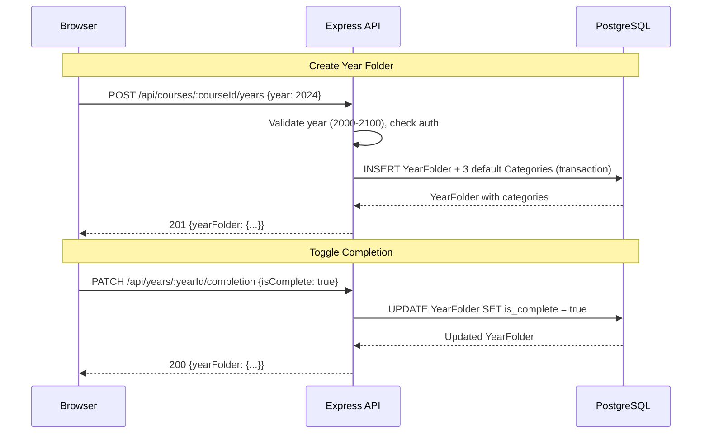
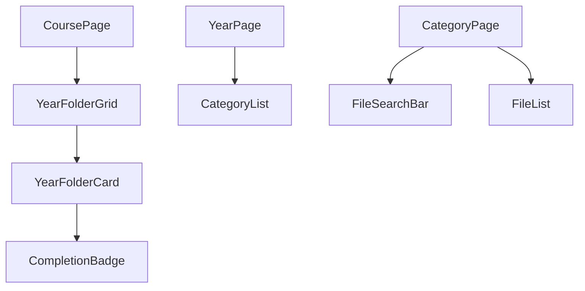
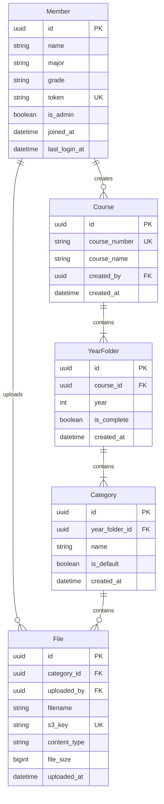

# Design Document: Year Subfolders

## Overview

This feature adds a year-based organizational layer to the Pyxis course materials platform. Currently, courses contain categories directly (Exams, Problem_Sets, Lectures). After this change, courses contain year folders, and each year folder contains its own set of categories. The navigation hierarchy becomes: Home → Course → Year → Category → Files.

Additionally, this feature introduces:
- A file search bar on the Category page for client-side filename filtering
- A completion toggle on year folders so members can signal when a year's materials are complete

### Key Design Decisions

| Decision | Choice | Rationale |
|----------|--------|-----------|
| Year Folder model | New `YearFolder` Prisma model | Clean separation; avoids overloading Course or Category models |
| Category FK change | Category.yearFolderId replaces Category.courseId | Categories now belong to a year context, not the course directly |
| Auto-create categories | On YearFolder creation, auto-create 3 defaults | Maintains the existing UX where each grouping has Exams, Problem_Sets, Lectures |
| File search | Client-side filter on loaded list | Files are already paginated and loaded; no API change needed |
| Completion toggle | Single PATCH endpoint with boolean body | Simple toggle semantics; any authenticated member can mark/unmark |
| Year validation | 2000–2100 integer range | Covers realistic academic years without allowing nonsense values |
| Sort order | Descending by year value | Most recent year first matches user expectation |
| Route structure | `/courses/:courseId/years/:yearId` | Mirrors the existing nested pattern, clear URL semantics |

## Architecture

### Updated Navigation Flow


### Data Flow for Year Folder Operations



### Updated Component Hierarchy (affected area)



## Components and Interfaces

### New/Modified API Routes

#### Year Folders

| Method | Path | Description |
|--------|------|-------------|
| GET | `/api/courses/:courseId/years` | List year folders for a course (descending by year) |
| POST | `/api/courses/:courseId/years` | Create a year folder (auto-creates default categories) |
| GET | `/api/years/:yearId` | Get a single year folder with its categories |
| DELETE | `/api/years/:yearId` | Delete a year folder (cascades to categories and files) |
| PATCH | `/api/years/:yearId/completion` | Toggle completion status |

#### Modified Category Routes

| Method | Path | Description |
|--------|------|-------------|
| GET | `/api/years/:yearId/categories` | List categories for a year folder (alphabetically) |
| POST | `/api/years/:yearId/categories` | Create a custom category within a year folder |

### New Backend Files

```
server/src/
├── routes/
│   └── yearFolder.routes.ts       # Year folder CRUD + completion toggle
├── services/
│   └── yearFolder.service.ts      # Business logic for year folders
└── validators/
    └── yearFolder.validator.ts    # Zod schema for year validation
```

### New Frontend Files

```
client/src/
├── api/
│   └── yearFolders.ts             # API client functions for year folders
├── components/
│   ├── years/
│   │   ├── YearFolderGrid.tsx     # Grid layout for year folder cards
│   │   ├── YearFolderCard.tsx     # Individual year card with completion badge
│   │   ├── AddYearModal.tsx       # Modal for creating a new year folder
│   │   └── CompletionBadge.tsx    # Green checkmark badge component
│   └── files/
│       └── FileSearchBar.tsx      # Search input for filtering files by name
├── pages/
│   └── YearPage.tsx               # New page: shows categories for a year
└── types/
    └── index.ts                   # Updated with YearFolder type
```

### Modified Frontend Files

| File | Change |
|------|--------|
| `App.tsx` | Add route `/courses/:courseId/years/:yearId` for YearPage |
| `CoursePage.tsx` | Replace CategoryList with YearFolderGrid |
| `CategoryPage.tsx` | Add FileSearchBar, update route params |
| `Breadcrumbs.tsx` | Add year segment to breadcrumb path |
| `api/courses.ts` | Remove category fetching from course detail (moved to year) |

### Frontend Route Updates

| Current Route | New Route | Page |
|---------------|-----------|------|
| `/courses/:courseId` | `/courses/:courseId` (unchanged) | CoursePage (now shows year folders) |
| — | `/courses/:courseId/years/:yearId` | YearPage (new) |
| `/courses/:courseId/categories/:categoryId` | `/courses/:courseId/years/:yearId/categories/:categoryId` | CategoryPage (updated path) |

### Component Specifications

#### YearFolderCard

Props:
```typescript
interface YearFolderCardProps {
  yearFolder: YearFolder;
  courseId: string;
}
```

Displays:
- Four-digit year value as primary text
- Total file count across all categories (from API response)
- Green checkmark icon when `isComplete === true`
- Clickable — navigates to `/courses/:courseId/years/:yearId`

#### FileSearchBar

Props:
```typescript
interface FileSearchBarProps {
  searchTerm: string;
  onSearchChange: (term: string) => void;
  totalFiles: number;
  matchedFiles: number;
}
```

Behavior:
- Renders a text input with a search icon
- Calls `onSearchChange` on every keystroke (controlled component)
- Displays match count: "Showing X of Y files"
- When empty, parent displays all files unfiltered

#### CompletionBadge

Props:
```typescript
interface CompletionBadgeProps {
  isComplete: boolean;
}
```

Renders a green checkmark SVG icon when `isComplete` is true, hidden otherwise.

## Data Models

### Updated Entity Relationship Diagram



### New Prisma Model: YearFolder

```prisma
model YearFolder {
  id         String   @id @default(uuid())
  courseId    String   @map("course_id")
  course     Course   @relation(fields: [courseId], references: [id], onDelete: Cascade)
  year       Int
  isComplete Boolean  @default(false) @map("is_complete")
  createdAt  DateTime @default(now()) @map("created_at")

  categories Category[]

  @@unique([courseId, year])
  @@index([courseId])
  @@map("year_folders")
}
```

### Modified Category Model

```prisma
model Category {
  id           String     @id @default(uuid())
  yearFolderId String     @map("year_folder_id")
  yearFolder   YearFolder @relation(fields: [yearFolderId], references: [id], onDelete: Cascade)
  name         String
  isDefault    Boolean    @default(false) @map("is_default")
  createdAt    DateTime   @default(now()) @map("created_at")

  files File[]

  @@unique([yearFolderId, name])
  @@map("categories")
}
```

### Modified Course Model

```prisma
model Course {
  id          String   @id @default(uuid())
  courseNumber String   @unique @map("course_number")
  courseName  String   @map("course_name")
  createdById String   @map("created_by")
  createdBy   Member   @relation(fields: [createdById], references: [id])
  createdAt   DateTime @default(now()) @map("created_at")

  yearFolders YearFolder[]

  @@map("courses")
}
```

Note: The `categories` relation is removed from Course. Course now has `yearFolders`, and categories belong to year folders.

### TypeScript Types (Frontend)

```typescript
export interface YearFolder {
  id: string;
  courseId: string;
  year: number;
  isComplete: boolean;
  createdAt: string;
  fileCount: number;  // Aggregated from API response
}

export interface YearFolderWithCategories extends YearFolder {
  categories: Category[];
}
```

### Updated Category Type

```typescript
export interface Category {
  id: string;
  yearFolderId: string;  // Changed from courseId
  name: string;
  isDefault: boolean;
  createdAt: string;
}
```

### Migration Strategy

The Prisma migration will:
1. Create the `year_folders` table
2. Add `year_folder_id` column to `categories` (nullable initially)
3. For each existing category, create a year folder (e.g., year 2024) for the parent course if one doesn't exist, then set the category's `year_folder_id`
4. Drop the `course_id` column from `categories`
5. Add the unique constraint on `(year_folder_id, name)`
6. Drop the old unique constraint on `(course_id, name)`

### Validation Rules

| Entity | Field | Constraint |
|--------|-------|-----------|
| YearFolder | year | Integer, 2000 ≤ year ≤ 2100 |
| YearFolder | (courseId, year) | Unique pair |
| Category | (yearFolderId, name) | Unique pair |
| FileSearchBar | search term | Any string (no server validation, client-side filter) |


## Correctness Properties

*A property is a characteristic or behavior that should hold true across all valid executions of a system — essentially, a formal statement about what the system should do. Properties serve as the bridge between human-readable specifications and machine-verifiable correctness guarantees.*

### Property 1: Year value validation

*For any* integer value, the year validation function should accept it if and only if the value is between 2000 and 2100 inclusive. All values outside this range should be rejected.

**Validates: Requirements 1.4, 2.4**

### Property 2: Course-year uniqueness

*For any* course and any year value, attempting to create a second year folder with the same (courseId, year) pair should be rejected, while distinct pairs should succeed.

**Validates: Requirements 1.2, 2.3**

### Property 3: Default completion status on creation

*For any* valid year folder creation (valid course, valid year in range), the resulting year folder should have `isComplete` equal to `false`.

**Validates: Requirements 1.3**

### Property 4: Year folder descending sort

*For any* list of year folders belonging to a course, the sort function should produce output where each year folder's year value is greater than or equal to the next year folder's year value (descending order).

**Validates: Requirements 2.2, 7.4**

### Property 5: Year folder-category name uniqueness

*For any* year folder and category name, attempting to create a second category with the same (yearFolderId, name) pair should be rejected, while distinct pairs should succeed.

**Validates: Requirements 3.2**

### Property 6: Default categories on year folder creation

*For any* valid year folder creation, the resulting year folder should contain exactly three categories named "Exams", "Lectures", and "Problem_Sets", each marked as default.

**Validates: Requirements 3.3**

### Property 7: Cascade delete removes all children

*For any* year folder with associated categories and files, deleting the year folder should result in zero categories and zero files remaining that reference that year folder's ID.

**Validates: Requirements 3.4**

### Property 8: Category alphabetical sort within year

*For any* list of categories within a year folder, the sort function should produce output where each category's name is lexicographically less than or equal to the next category's name.

**Validates: Requirements 4.3**

### Property 9: Breadcrumb generation includes year segment

*For any* valid navigation path of the form [Home, Course, Year, Category], the breadcrumb function should produce an ordered list of segments where each segment contains a label and a navigation link, and the year segment appears between course and category.

**Validates: Requirements 4.4**

### Property 10: File search filter correctness

*For any* list of files and any search term, the filter function should return exactly those files where the filename contains the search term as a case-insensitive substring. When the search term is empty, all files should be returned.

**Validates: Requirements 5.2, 5.3**

### Property 11: Completion toggle round-trip

*For any* year folder, setting `isComplete` to `true` and then setting it to `false` should return the year folder to its original completion state (`false`). Conversely, setting to `true` should result in `isComplete === true`.

**Validates: Requirements 6.1, 6.2**

### Property 12: File count aggregation

*For any* year folder with files distributed across its categories, the reported file count should equal the sum of file counts across all categories within that year folder.

**Validates: Requirements 7.2**

## Error Handling

### New Error Scenarios

| Scenario | HTTP Status | Code | User-Facing Message |
|----------|-------------|------|---------------------|
| Year already exists for course | 409 | YEAR_EXISTS | "A year folder for {year} already exists in this course" |
| Year value out of range | 422 | VALIDATION_ERROR | "Year must be between 2000 and 2100" |
| Year folder not found | 404 | NOT_FOUND | "Year folder not found" |
| Category already exists in year | 409 | CATEGORY_EXISTS | "This category already exists in this year folder" |

### Error Handling Approach

The year folder feature follows the existing error handling patterns:

1. **Validation layer** (Zod schema in `yearFolder.validator.ts`): Rejects invalid year values before reaching the service layer.
2. **Service layer** (`yearFolder.service.ts`): Catches Prisma unique constraint violations and throws typed `AppError` with the `YEAR_EXISTS` code.
3. **Global error handler**: Catches unhandled errors and returns sanitized 500 responses.

### Client-Side Error Handling

- **AddYearModal**: Displays inline validation error if year is out of range. Shows toast notification on 409 conflict.
- **Completion toggle**: Optimistic UI update with rollback on failure. Shows toast notification on error.
- **File search**: No error states possible (pure client-side string filtering).

## Testing Strategy

### Unit Tests

Unit tests cover:
- **Year validation function**: Range boundary checks (1999, 2000, 2100, 2101, non-integers)
- **File search filter function**: Case-insensitive matching, empty term, special characters
- **Year folder sort function**: Descending order verification
- **Category sort function**: Alphabetical order (reuses existing logic)
- **Breadcrumb generation**: Path with year segment produces correct output
- **File count aggregation**: Sum across categories

Framework: **Vitest**

### Property-Based Tests

Property-based tests verify universal correctness properties using **fast-check**.

Configuration:
- Minimum 100 iterations per property test
- Each property test tagged with: `Feature: year-subfolders, Property {N}: {title}`
- Properties 1–12 each map to a single property-based test

Key property test groups:
- **Validation** (Properties 1, 2, 5): Year range, uniqueness constraints
- **Creation side-effects** (Properties 3, 6): Default values, auto-created categories
- **Sorting** (Properties 4, 8): Descending year order, alphabetical categories
- **Search/filter** (Property 10): Case-insensitive substring matching
- **State management** (Properties 7, 11): Cascade delete, completion toggle round-trip
- **Aggregation** (Property 12): File count computation
- **Navigation** (Property 9): Breadcrumb generation

### Integration Tests

Integration tests cover:
- **Year folder CRUD**: Create, list, delete with database verification
- **Cascade delete**: Verify categories and files are removed when year folder is deleted
- **Completion toggle endpoint**: PATCH request updates database correctly
- **Category creation within year**: POST to new route creates category linked to year folder
- **Migration verification**: Existing data is correctly migrated to year-based structure

Framework: **Vitest** with **supertest** for HTTP assertions

### Migration Testing

- Verify existing categories are reassigned to auto-generated year folders
- Verify no orphaned categories after migration
- Verify file access is unbroken through the new FK chain
